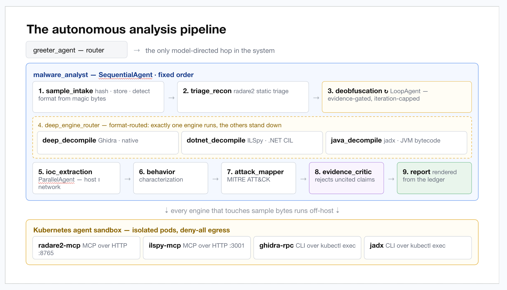
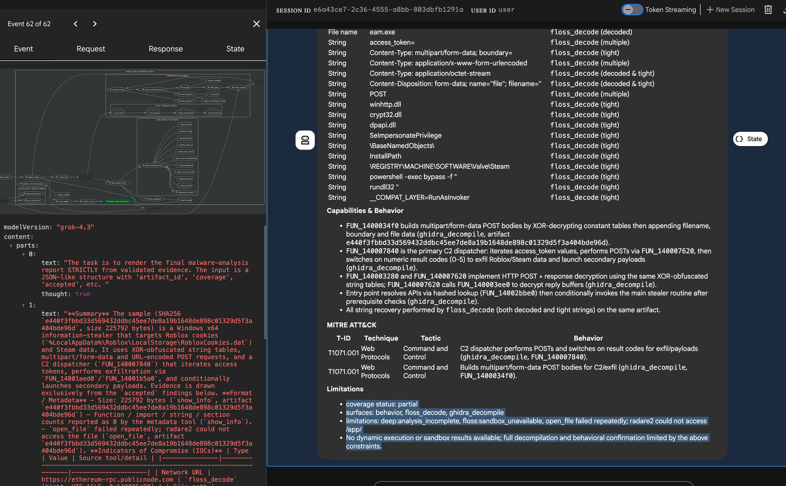
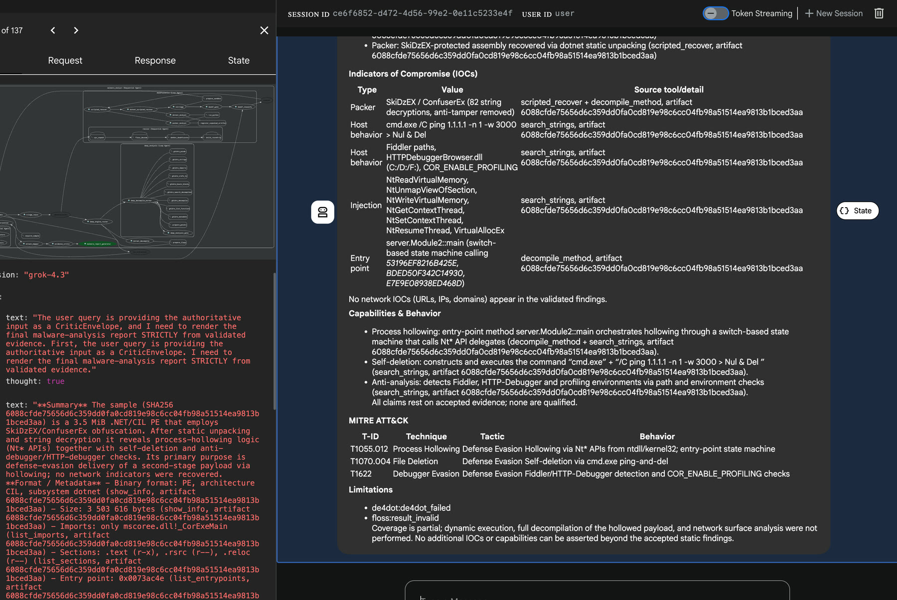
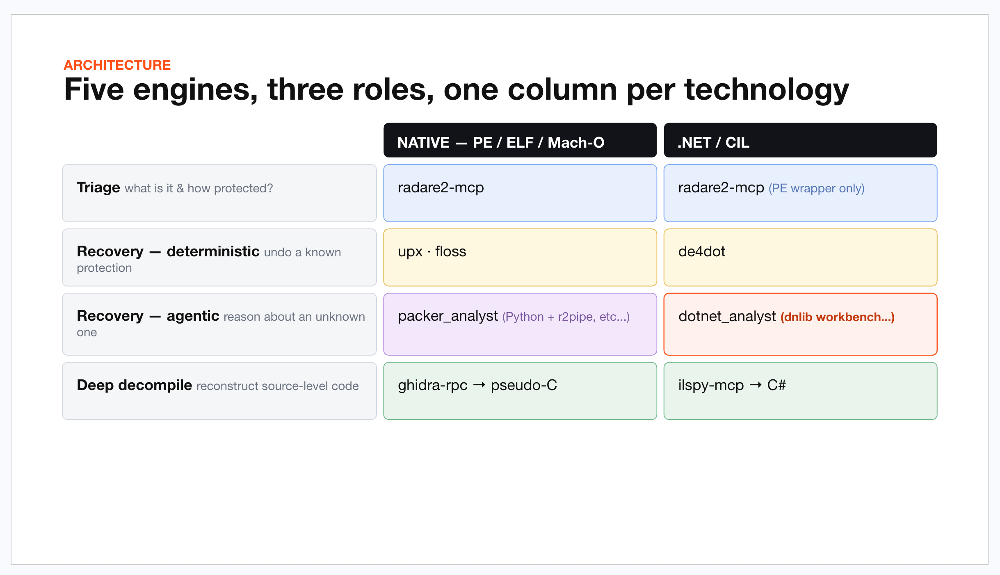
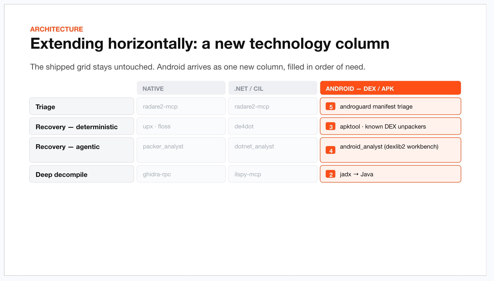
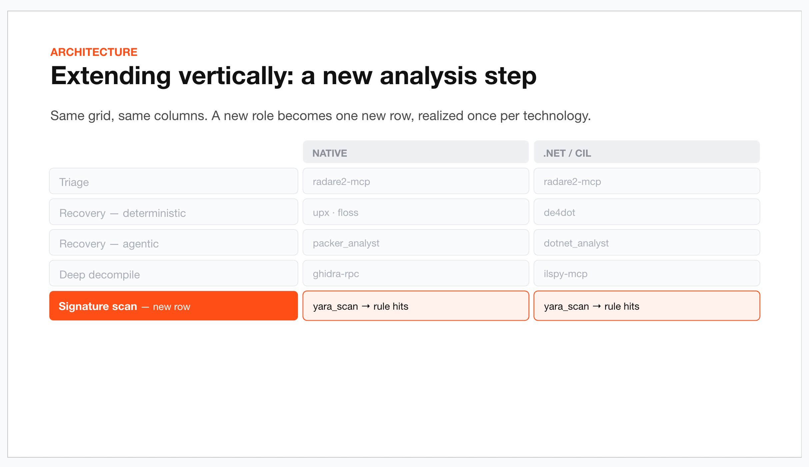

# AREMA

**Autonomous Reverse Engineering & Malware Analysis (AREMA)** is a multi-agent system for
**static** malware analysis, built on
[Google's Agent Development Kit (ADK)](https://google.github.io/adk-docs/). A
domain-neutral runtime core hosts pluggable analysis domains; the shipped domain
is an autonomous **malware-analysis pipeline** that triages, deobfuscates,
decompiles, and reports on a sample, with **every finding cited to the tool that
produced it**.

<p align="center">
  
</p>

<p align="center"><sub><b>The autonomous pipeline.</b> One model-directed hop (the greeter router) hands off to a deterministic <code>SequentialAgent</code> of nine fixed-order stages; every engine that touches sample bytes runs off-host in an isolated, deny-all-egress Kubernetes pod.</sub></p>

---

## What it does

- **An autonomous malware-analysis pipeline** (`malware_analyst`) is an ADK
  `SequentialAgent` that runs nine analysis stages in a fixed,
  framework-enforced order, each producing evidence the next consumes. The
  pipeline covers native, .NET, and Android (apk/dex/jar) samples:
  1. **Intake**: acquire the sample, classify container format, prepare the
     sandboxed engines (radare2 always; ILSpy for .NET; jadx/androguard for
     Android).
  2. **Triage**: radare2 static triage → evidence-backed findings.
  3. **Deobfuscation.** A bounded loop: classify obfuscation, recover
     (UPX → FLOSS → de4dot → dnlib), retriage, and gate, plus model-directed
     **agentic recovery** for stubborn native packers and protected .NET
     assemblies.
  4. **Deep decompilation**: route by format to **Ghidra** (native),
     **ILSpy** (.NET), or **jadx** (Android/DEX, with Ghidra over the extracted
     native `.so`) and drive a bounded decompilation loop.
  5. **IOC extraction**: synthesize host and network indicators from the
     accumulated evidence.
  6. **Behavior characterization** and 7. **MITRE ATT&CK mapping**.
  8. **Evidence validation**: a consistency critic that rejects any claim not
     cited to real tool evidence and folds coverage limitations into the report.
  9. **Report**: a threat-intel-style report (IOCs, capabilities, ATT&CK,
     limitations), followed by a deterministic **per-model token-usage & cost**
     appendix.

- **A Kubernetes analysis sandbox.** Each engine runs in an isolated WarmPool
  pod: **2 MCP servers** (radare2, ILSpy) and **4 in-pod CLI toolsets** (Ghidra,
  jadx, the deobfuscation toolset covering UPX/FLOSS/de4dot/dnlib/androguard, and a
  Python scripting workbench). The workbench enforces a deny-all egress
  NetworkPolicy, verifiable
  with `make sandbox-verify-egress`.

- **Agentic recovery**: when the cheap tools can't unpack a sample,
  model-directed agents (`packer_analyst`, `dotnet_analyst`) statically reverse
  the packer/protector inside the workbench and reconstruct a loadable artifact.

- **Evidence discipline**: structured evidence flows stage-to-stage; the critic
  gate blocks unsupported claims; the report cites the producing tool + artifact
  id for every finding, and states what could and could not be determined.

- **Per-model token & cost accounting**: a deterministic final stage appends a
  per-model token table (input / cached / output / thinking / total) and USD
  cost, computed from provider usage metadata (never authored by the LLM). It
  reconciles to the provider's authoritative token total, so reasoning models
  are counted correctly; pricing is configurable via `AREMA_MODEL_PRICE_OVERRIDES`.

- **Multi-provider models**: Google Gemini, OpenAI, Anthropic, Ollama, LM
  Studio, any OpenAI-compatible endpoint, Z.AI, and xAI, all via LiteLLM,
  selectable by environment variable with optional per-agent overrides.

## See it in action

Running through ADK's developer web UI: the agent graph on the left, the
evidence-cited report on the right, and the model's reasoning streaming below.
Every IOC, capability, and ATT&CK technique carries the **producing tool + artifact
id**; the report closes with an explicit **limitations** list rather than
inventing what static analysis can't reach.

<p align="center">
  
</p>

<p align="center"><sub><b>Native infostealer.</b> A Roblox/Steam credential stealer: FLOSS recovers the obfuscated string tables, Ghidra attributes the C2 dispatcher and multipart-POST exfil builder by function, and the critic keeps only tool-cited findings, flagging partial coverage where an engine was unavailable.</sub></p>

<p align="center">
  
</p>

<p align="center"><sub><b>.NET, ConfuserEx-protected.</b> The agentic <code>dotnet_analyst</code> statically unpacks the SkiDzEX/ConfuserEx protection, then decompilation surfaces process-hollowing, self-deletion, and anti-analysis behavior, each mapped to ATT&CK, with de4dot/FLOSS limitations recorded honestly.</sub></p>

## Architecture

Three layers, dependencies pointing strictly downward:

- **Domain-neutral core (`src/arema`)** is the composition root, an immutable and
  whole-graph-validated capability registry (`RuntimeProfile`,
  `AgentDescriptor`, `ToolDescriptor`, `McpServerDescriptor`), the runtime
  (agent factory + a validated callback chain), context budgeting and
  resilience, backend-neutral structured memory, and the neutral token-accounting
  seam. **The core holds no domain knowledge**: a guard test
  (`tests/architecture/test_neutral_boundaries.py`) fails the build if any
  concrete tool or domain term leaks into `src/arema`.
- **Shared RE infrastructure (`src/reverse_engineering`)**: the engines,
  deobfuscation tools, agentic-recovery agents, and evidence types that domains
  compose. An importable library, not a standalone ADK app.
- **Domains**: `src/malware_analyst` composes the RE infrastructure into the
  pipeline above. `src/greeter_agent` is a welcome router that delegates to
  domain agents (today: `malware_analyst`; built to add more).

Full layering, the ADK discovery model, and the add-a-domain recipe are in the
[documentation](#documentation).

### The capability grid

The analysis capability is a **grid**: rows are the roles a sample passes through
(triage → deterministic recovery → agentic recovery → deep decompile), columns
are the technologies. Each cell is the engine that plays that role for that
technology, and the deep-engine router runs **exactly one column** per sample;
the others stand down. The two founding columns, native and .NET:

<p align="center">
  
</p>

The grid is what makes the system **extensible without disturbing what already
ships**: coverage grows on two independent axes.

<p align="center">
  
</p>

<p align="center"><sub><b>Horizontally</b>: a new technology is one new column. Android (apk/dex/jar) joined as the third, filled role by role in order of need, leaving native and .NET untouched.</sub></p>

<p align="center">
  
</p>

<p align="center"><sub><b>Vertically</b>: a new role is one new row, realized once per column (shown here as an illustrative signature-scan step). Same grid, same columns.</sub></p>

## Requirements

- **Python 3.11+**
- [uv](https://docs.astral.sh/uv/) for dependency management
- A credential for whichever LLM provider you select (local providers such as
  Ollama, LM Studio, and OpenAI-compatible endpoints need none)
- **For the analysis engines:** a Kubernetes cluster (Kind by default). Without
  the sandbox you can still run the neutral smoke agent; the pipeline's engine
  stages require it. See [`docs/DEVELOPMENT.md`](docs/DEVELOPMENT.md).

## Quick start

```bash
# 1. Install the project and its dev tooling
uv sync --extra dev            # or: make setup

# 2. Configure a provider
cp .env.example .env           # set AREMA_LLM_PROVIDER + the matching API key

# 3a. Run the malware pipeline via the greeter router
make adk-run                   # interactive  (adk run src/greeter_agent)
make adk-web                   # ADK developer web UI (lists greeter_agent + domains)
#     then ask, e.g.: "analyze the sample at /path/to/file"

# 3b. Or exercise the neutral runtime with the no-tools smoke agent
uv run arema                                 # interactive
uv run arema --query "Are you operational?"  # one-shot
```

`uv run arema` drives the **neutral-core smoke agent** (single, no-tools: it
proves model connectivity, sessions, context policies, resilience callbacks, and
memory health). The **analysis pipeline** runs through ADK:
`make adk-run`/`make adk-web`, or `adk run src/malware_analyst` to drive the
domain directly. Full sandbox bring-up (engine images, WarmPools, egress
enforcement) is in [`docs/DEVELOPMENT.md`](docs/DEVELOPMENT.md).

## Configuration

All configuration is environment-driven through `arema.core.config.Settings`
(Pydantic Settings, loaded from `.env`); `.env.example` documents every field.
Highlights:

- **Provider selection + credentials**: 8 providers, `google` (default),
  `openai`, `anthropic`, `ollama`, `lmstudio`, `openai_compatible`, `zai`, `xai`.
- **Per-agent model overrides**: point any agent at a different model
  (`AREMA_AGENT_MODEL_OVERRIDES`), e.g. a strong coding model for the agentic
  `dotnet_analyst` / `packer_analyst`.
- **Token pricing**: `AREMA_MODEL_PRICE_OVERRIDES` supplies/overrides per-model
  USD rates (per 1M tokens); unpriced models render `?` and are excluded from
  the cost total rather than assumed free.
- **Kubernetes sandbox**: `AREMA_SANDBOX_ENABLED`, `AREMA_SANDBOX_POOL_MAP`,
  namespace, and timeouts.
- Plus context budget, turn limits, memory backend/path, and logging. Memory
  defaults to `~/.arema/memory/arema.db`; set `AREMA_MEMORY_BACKEND=memory` for
  ephemeral runs.

## Extending AREMA

Register immutable descriptors in a composition builder before `builder.freeze`.
The neutral core stays domain-free; domains (like `malware_analyst`) do the
registration. One registration per descriptor kind:

```python
# An agent (needs a packaged prompt <prompt_id>.md)
builder.add_agent(AgentDescriptor(
    id="worker_agent", name="worker_agent", description="A neutral agent.",
    prompt_id="worker_agent", factory=build_llm_agent,
    runtime_profile_id="safe_default",
))

# A tool (descriptor id must equal the tool's runtime name)
builder.add_tool(ToolDescriptor(
    id="clock_now", description="Return the current UTC time.",
    tool=clock_now, output_policy=OutputPolicy(max_chars=2_000),
))

# An MCP server (radare2 and ILSpy ship this way: a validated descriptor
# whose toolset is built and attached to the agent that lists it)
builder.add_mcp_server(McpServerDescriptor(
    id="example_mcp",
    transport=StdioTransport(command="example-mcp-server", args=("--stdio",)),
))

# A memory codec / a runtime profile
codecs.register(RecordCodec(namespace="example", kind="finding",
    schema_version=1, payload_type=FindingRecord))
builder.add_runtime_profile(RuntimeProfile(
    id="fast_isolated", context_mode=ContextMode.ISOLATED, throttle_model=False))
```

The catalog validator enforces that every reference resolves, every agent is
reachable from the root, the sub-agent graph is acyclic, transports are safe,
and every declared codec exists. A frozen catalog is guaranteed safe to build.
Full recipes: [`docs/EXTENDING_AREMA.md`](docs/EXTENDING_AREMA.md) and, for
building tools/toolsets/MCP servers, [`docs/CREATING_TOOLS.md`](docs/CREATING_TOOLS.md).

## Development

```bash
make check          # lint + format-check + type-check + tests
make test           # full test suite
make test-unit      # unit tests only
make test-component # component tests only
make lint / make format-check / make type-check
```

Tooling is strict: Ruff (lint + format), mypy `--strict` over `src/arema`, and
pytest with Hypothesis; the suite runs roughly **1,600 tests** across unit,
component, and architecture suites. CI runs the same checks on Python 3.11 and 3.12. Sandbox
bring-up and day-to-day engine commands are in
[`docs/DEVELOPMENT.md`](docs/DEVELOPMENT.md).

## Project layout

```
src/
├── arema/                 domain-neutral core
│   ├── agent.py           ADK entry point (neutral smoke root_agent)
│   ├── cli.py             the `arema` CLI (interactive / --query / --web)
│   ├── composition.py     neutral composition root
│   ├── runner.py          run_single_query (scope lifecycle)
│   ├── core/              config, logging, model factory (LiteLLM)
│   ├── registry/          descriptors, catalog builder/validator, MCP toolset
│   ├── runtime/           agent factory, callback chain, context, services,
│   │                      sandbox port, token accounting
│   ├── memory/            store port, in-memory + SQLite backends, codecs
│   └── prompts/           packaged neutral prompts
├── reverse_engineering/   shared RE infrastructure (engines, deobfuscation,
│                          agentic recovery, evidence types), a library
├── malware_analyst/       the malware-analysis domain (pipeline + report)
└── greeter_agent/         welcome router → domain agents

deploy/sandbox/            Kind cluster + Agent Sandbox templates/WarmPools
images/                    six engine images (radare2-mcp, ghidra-rpc,
                           deobfuscation-tools, ilspy-mcp, jadx,
                           analysis-workbench)
tests/                     unit, component, architecture suites
docs/                      see below
```

## Documentation

| Doc | What it covers |
|-----|----------------|
| [`docs/ARCHITECTURE.md`](docs/ARCHITECTURE.md) | Layering, composition sequence, callback-chain invariants, one-run data flow |
| [`docs/AGENTS_AND_DISCOVERY.md`](docs/AGENTS_AND_DISCOVERY.md) | Multi-agent layout, ADK discovery, the add-a-domain recipe |
| [`docs/DEVELOPMENT.md`](docs/DEVELOPMENT.md) | End-to-end setup incl. the Kubernetes sandbox |
| [`docs/SANDBOXING.md`](docs/SANDBOXING.md) | The sandbox execution layer and isolation model |
| [`docs/CREATING_TOOLS.md`](docs/CREATING_TOOLS.md) | Building function tools, CLI toolsets, and MCP servers |
| [`docs/TOOLS_USAGE.md`](docs/TOOLS_USAGE.md) | The engine/tool surface in use |
| [`docs/EXTENDING_AREMA.md`](docs/EXTENDING_AREMA.md) | Full descriptor recipes and validation rules |
| [`docs/CONTEXT_AND_RESILIENCE.md`](docs/CONTEXT_AND_RESILIENCE.md) | Output compaction, context budgeting, resilient MCP, fail-open memory |

## License

MIT.
